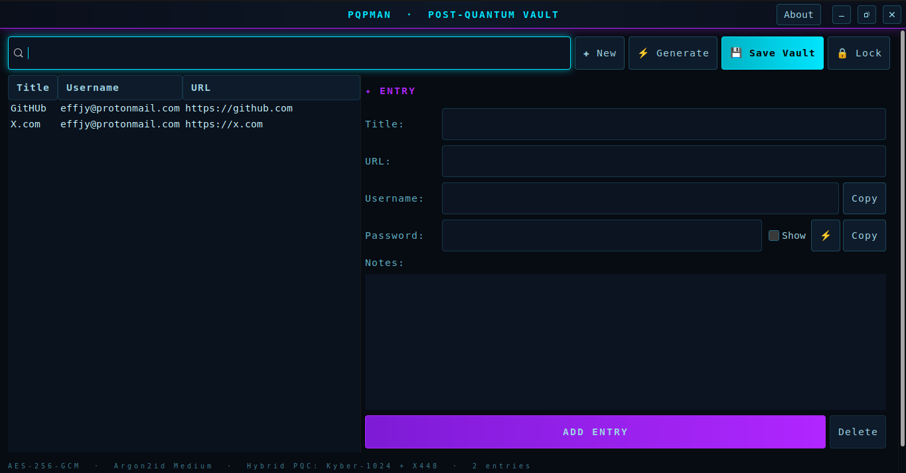

<div align="center">

# ⛨ PQPMan v1.1.0

**A post-quantum password manager for the Linux desktop — your vault is sealed
with authenticated encryption and a hybrid Kyber-1024 + X448 key
encapsulation, all behind a single master password.**

Author: **Jean-Francois Lachance-Caumartin**

[](LICENSE)
[](https://github.com/effjy/pqpman/releases)
[](#)
[](#)
[](#)

[](#how-the-protection-works)
[](#how-the-protection-works)
[](#how-the-protection-works)
[](#how-the-protection-works)
[](https://libsodium.org)

[](https://github.com/effjy/pqpman/issues)
[](https://github.com/effjy/pqpman/commits)

</div>

---

## Screenshot

<div align="center">



*The PQPMan vault view — the entry list, the credential editor and the
built-in password generator, all in one cyber-styled window.*

</div>

---

## What it is

PQPMan stores your credentials in a single encrypted **vault** file. Each
entry has a **title**, a **location / URL**, a **username**, the **password**,
and free-form **notes**. The vault is protected with a master password — and,
optionally, with a post-quantum hybrid key encapsulation so it stays secure
even against a future quantum adversary.

## How the protection works

The vault is serialized in memory and encrypted as a single AEAD blob with
either **AES-256-GCM** or **XChaCha20-Poly1305** (your choice when you create
the vault). The AEAD key is protected by your master password as follows:

- **Classical mode** — the master password is run through **Argon2id**
  (Basic 256 MiB / Medium 1 GiB / Strong 4 GiB) to derive the AEAD key
  directly.
- **Post-quantum hybrid mode** *(recommended, on by default)* — a fresh
  **Kyber-1024** (NIST level 5) + **X448** keypair is generated for the vault.
  The KEM shared secret becomes the AEAD key; the matching secret key is
  *wrapped* with the Argon2id master key. The two component secrets are mixed
  through BLAKE2b, so the vault stays secure as long as **either** Kyber **or**
  X448 holds. A single master password still unlocks everything.

Nothing decrypted ever touches the disk: serialization and encryption happen
entirely in **locked, non-dumpable memory** (no swap, no core dumps), and
secrets are zeroed after use. The master-password fields, the password
generator's output and the clipboard's auto-clear copy are all backed by
libsodium guarded memory.

## Features

- Encrypted credential vault with title / URL / username / password / notes.
- **AES-256-GCM** or **XChaCha20-Poly1305** authenticated encryption.
- **Argon2id** master-key derivation (Basic / Medium / Strong).
- Optional **post-quantum hybrid KEM** (Kyber-1024 + X448), auto-detected on
  unlock.
- **Built-in password generator** with a length slider and selectable
  character sets, reporting **two entropy figures**:
  - *Naive (search-space) entropy* — `length × log₂(pool size)`, the correct
    strength measure for a randomly generated password;
  - *Real (Shannon) entropy* — the Shannon entropy of the actual output
    string, a useful lower-bound sanity check.
- Live search/filter over the entry list.
- One-click **copy** of usernames and passwords, with the clipboard
  **auto-clearing after 25 seconds**.
- Hardened memory handling and a slow-KDF worker thread so the UI never
  freezes.
- A cyber-styled dark interface and a desktop/taskbar icon.

## Prerequisites

A C compiler, `make`, and the development packages for GTK3, libsodium,
libargon2 and OpenSSL (libcrypto, used for the X448 curve).

### Ubuntu / Debian

```bash
sudo apt update
sudo apt install build-essential pkg-config \
    libgtk-3-dev libsodium-dev libargon2-dev libssl-dev
```

### Fedora

```bash
sudo dnf install gcc make pkgconf-pkg-config \
    gtk3-devel libsodium-devel libargon2-devel openssl-devel
```

## Get the source

```bash
git clone https://github.com/effjy/pqpman.git
cd pqpman
```

## Building

```bash
make
```

This produces the `pqpman` binary in the project directory; run it with
`./pqpman`.

## Installing

```bash
sudo make install
```

This installs:

| File | Destination |
|------|-------------|
| `pqpman` binary  | `/usr/local/bin/pqpman` |
| Application icon | `/usr/local/share/icons/hicolor/scalable/apps/pqpman.svg` (+ raster sizes) |
| Menu entry       | `/usr/local/share/applications/pqpman.desktop` |

The desktop database and icon cache are refreshed automatically, so PQPMan
appears in your applications menu and shows its icon in the window/taskbar.

To uninstall:

```bash
sudo make uninstall
```

> Installation prefix is configurable, e.g. `sudo make install PREFIX=/usr`.

## Usage

1. Launch **PQPMan** from the applications menu, or run `pqpman`.
2. **Create a new vault**: pick *Create new*, choose where to store it, pick a
   cipher / key strength / hybrid setting, then set and confirm a master
   password.
3. **Unlock an existing vault**: pick *Open existing*, choose the vault file,
   and type your master password.
4. In the vault:
   - Click **+ New** (or an existing entry) and fill in the fields. Use the
     **⚡** button next to the password to open the generator.
   - **Copy** puts a value on the clipboard (it auto-clears after 25 s).
   - **Add Entry / Save Changes** stores the entry *in memory*; click
     **💾 Save Vault** to re-encrypt and write it to disk.
   - **🔒 Lock** wipes the in-memory secrets and returns to the unlock screen.

The default vault lives at `~/.local/share/pqpman/vault.pqp`.

## Vault file format

```
off  size  field
0    8     magic  "PQPMAN\0\0"
8    1     format_version (1 = password-only, 2 = hybrid KEM)
9    1     cipher_id (1 AES-256-GCM, 2 XChaCha20-Poly1305)
10   1     kdf_id (1 = Argon2id)
11   1     kdf_level
12   4     argon2 t_cost      | 16  4  argon2 m_cost (KiB)
20   4     argon2 parallelism | 24  16 salt
40   H     hybrid block (only when format_version == 2)
..   N     base nonce (cipher nonce length)
..   4     uint32 ciphertext length
..   *     AEAD ciphertext + tag of the serialized vault
```

The hybrid block holds a wrap nonce, the KEM secret key wrapped
(XChaCha20-Poly1305) with the Argon2id master key, and the KEM ciphertext. A
wrong master password is caught by the wrap tag before any vault bytes are
touched.

## Security notes

- Choose **Medium** or **Strong** key strength for real use; higher strengths
  use more RAM during key derivation (1 GiB / 4 GiB).
- Authenticated encryption guarantees integrity — a tampered vault will not
  decrypt.
- Secrets are kept off disk (no core dumps; locked, non-dumpable memory; zeroed
  after use). Note that GTK itself may still hold short-lived copies of typed
  text (for rendering, the clipboard or the input method) in ordinary memory,
  so this hardening reduces but cannot fully eliminate exposure.
- The entropy figures are estimates to guide password choice, not guarantees.
- Saves are crash-safe: the vault is written to a temporary file, flushed and
  `fsync`-ed, then atomically renamed over the old vault, and the containing
  directory is `fsync`-ed so the replacement survives a power loss.

## Changelog

### v1.1.0

- **Hardening:** the password generator's output field and the clipboard
  auto-clear copy are now held in libsodium guarded (locked, non-swappable)
  memory, like the master-password fields — generated and copied secrets no
  longer transit ordinary swappable heap.
- **Durability:** `vault_save` now `fsync`s the parent directory after the
  atomic rename, so a crash immediately after saving can no longer lose the
  newly written vault.
- **Robustness:** unlocking/creating a vault now fails with a clear message
  instead of crashing if secure (locked) memory for the master password could
  not be allocated (e.g. a low `RLIMIT_MEMLOCK`).
- **UI:** a freshly added or saved entry stays selected in the list.

## Credits

The cryptographic core (AES-256-GCM / XChaCha20-Poly1305 engine, Argon2id KDF,
the Kyber-1024 + X448 hybrid KEM and the libsodium-backed secure entry buffer)
is shared with its sibling project **Ciphers**.

## Contributing

Bug reports and feature requests are welcome on the
[issue tracker](https://github.com/effjy/pqpman/issues). The repository lives at
<https://github.com/effjy/pqpman/>.

## License

MIT.
